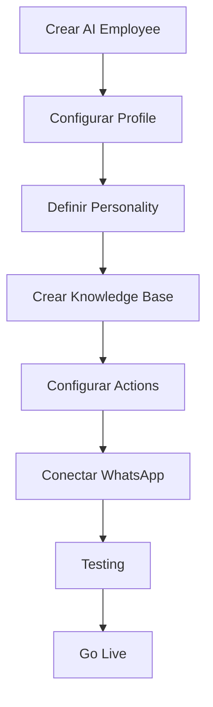

# 🐦 Bird.com Platform - Resumen Técnico

> Todo lo que necesitas saber sobre la plataforma Bird.com para implementar AI Employees exitosamente.

## 📋 ¿Qué es Bird.com?

Bird.com es una plataforma de Customer Engagement que permite crear AI Employees (empleados virtuales) para automatizar conversaciones a través de múltiples canales, con énfasis especial en WhatsApp Business API.

## 🔑 Características Clave

### AI Employees
- **Definición**: Agentes conversacionales impulsados por LLMs (GPT-3.5/GPT-4)
- **Capacidades**: Conversaciones naturales, acceso a knowledge base, acciones automatizadas
- **Canales**: WhatsApp, SMS, Email, Web Chat, Instagram, Facebook Messenger

### Configuración Manual
- ✅ **100% vía interfaz web** - No hay API de configuración
- ❌ **Sin imports JSON/YAML** - Todo se configura manualmente
- ✅ **Visual y validado** - Cada paso se valida en tiempo real
- ❌ **Sin scripting** - No se puede automatizar el setup

## 🏗️ Arquitectura de AI Employees

### 1. Profile & Model
```
Profile
├── Display Name (visible al usuario)
├── Avatar (imagen del agente)
├── Biography (descripción breve)
└── LLM Connector (OpenAI API)
    ├── Model Selection (GPT-3.5/GPT-4)
    ├── Temperature (0.0-1.0)
    └── Max Tokens
```

### 2. Personality Configuration
```
Personality
├── Purpose (misión del agente)
├── Tasks (lista de capacidades)
├── Audience (segmentación)
├── Tone (slider formal-casual)
└── Custom Instructions (reglas detalladas)
```

### 3. Knowledge Base
```
Knowledge Base
├── Folder Structure (carpetas organizadas)
├── Markdown Files (contenido .md)
├── Embedding Search (automático)
└── Semantic Retrieval (AI-powered)
```

### 4. AI Actions
```
Actions
├── Main Task (tarea principal)
├── Handover (transferencia)
├── Send Message (mensajes proactivos)
└── Resolve (cierre automático)
```

## 📱 WhatsApp Business Integration

### Capacidades Nativas
- **Mensajes Rich Media**: Imágenes, videos, documentos, ubicación
- **Elementos Interactivos**: Quick replies, list messages, buttons
- **Templates**: Mensajes pre-aprobados para notificaciones
- **Session Management**: Ventanas de 24 horas automáticas

### Limitaciones WhatsApp
- Rate limiting: 1,000 mensajes/día por número
- Template approval: 24-48 horas por Meta
- Session window: 24 horas después del último mensaje del usuario
- Media size: Max 16MB por archivo

## 🔧 Integraciones Disponibles

### APIs Nativas
- **Webhooks**: Eventos en tiempo real
- **Knowledge Base API**: Acceso programático a contenido
- **Conversations API**: Gestión de conversaciones
- **Contacts API**: Gestión de contactos

### Conectores Pre-construidos
- Salesforce
- HubSpot
- Shopify
- Google Calendar
- Microsoft 365
- Slack

### Custom Integrations
- REST APIs
- Webhooks bidireccionales
- OAuth 2.0
- API Keys

## 💰 Modelo de Pricing

### Componentes de Costo
1. **Bird Platform Fee**: Suscripción mensual base
2. **OpenAI API Costs**: Por tokens consumidos
3. **WhatsApp Costs**: Por conversación iniciada
4. **SMS/Email**: Por mensaje enviado

### Estimación Típica
```
Pequeña empresa (1 AI Employee, 1000 conv/mes):
- Bird Platform: $99/mes
- OpenAI (GPT-3.5): ~$50/mes
- WhatsApp: ~$50/mes
Total: ~$200/mes

Mediana empresa (3 AI Employees, 5000 conv/mes):
- Bird Platform: $299/mes
- OpenAI (GPT-4): ~$200/mes
- WhatsApp: ~$250/mes
Total: ~$750/mes
```

## 🚀 Mejores Prácticas de Plataforma

### Performance
1. **Knowledge Base**: Archivos de 500-2000 palabras
2. **Response Time**: <2 segundos objetivo
3. **Concurrent Users**: Hasta 200 simultáneos
4. **Uptime**: 99.9% SLA

### Seguridad
- Encriptación end-to-end
- GDPR compliant
- SOC 2 Type II
- Data residency options

### Monitoreo
- Dashboard en tiempo real
- Analytics detallados
- Exportación de datos
- Alertas configurables

## 🛠️ Flujo de Configuración Típico



## ⚠️ Limitaciones Importantes

### Técnicas
- No hay backup/restore automático
- Sin control de versiones nativo
- API de configuración no disponible
- Límite de 50 archivos por knowledge base

### Funcionales
- Un AI Employee por conversación
- Sin memoria entre sesiones (más allá de 24h)
- Templates WhatsApp requieren aprobación
- Personalización de UI limitada

## 🔍 Troubleshooting Común

### Problema: AI no encuentra información
**Solución**: Verificar estructura de knowledge base y keywords

### Problema: Respuestas lentas
**Solución**: Reducir tamaño de archivos, optimizar prompts

### Problema: Handover no funciona
**Solución**: Verificar horarios de agentes y reglas de escalación

### Problema: WhatsApp desconectado
**Solución**: Re-verificar número, checar límites de rate

## 📚 Recursos Oficiales

- **Documentación**: [support.bird.com](https://support.bird.com)
- **API Reference**: [docs.bird.com](https://docs.bird.com)
- **Status Page**: [status.bird.com](https://status.bird.com)
- **Community**: Bird.com Slack Channel

## 🎯 Conclusión

Bird.com es una plataforma robusta para AI Employees con excelente integración WhatsApp. La limitación de configuración manual se convierte en ventaja al forzar diseño deliberado y validación en cada paso.

**Clave del éxito**: Embracing manual configuration + Following BMAD methodology = AI Employees exitosos

---

*Última actualización: 2025-08-03 | Basado en Bird.com v2.0*