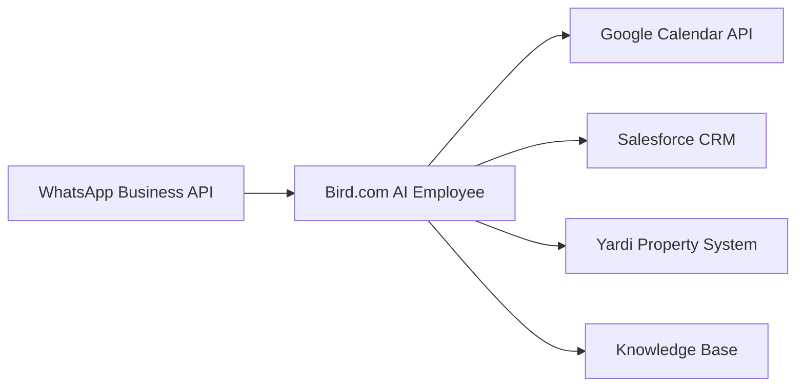

# 🏢 UrbanHub: Caso de Estudio Real Estate AI con BMAD

> Implementación completa de AI Employee para gestión de tours inmobiliarios usando la metodología BMAD en Bird.com

## 📊 Resumen Ejecutivo

UrbanHub transformó su proceso de atención al cliente implementando un AI Employee especializado en gestión de tours, logrando:
- ⏱️ Reducción de tiempo de respuesta de 4-6 horas a <5 minutos
- 📈 Aumento en conversión de tours del 15% al 25%
- 💰 ROI positivo en 2 meses con $450K NPV a 3 años
- 🌟 Satisfacción del cliente de 3.2 a 4.2/5.0

## 🏢 Contexto de Negocio

### Perfil de la Empresa
- **Industria**: Gestión y Arrendamiento Inmobiliario
- **Portfolio**: 500+ propiedades, 5,000+ inquilinos activos
- **Volumen**: 1,200+ consultas mensuales, 400+ prospectos
- **Mercado**: Propiedades residenciales urbanas en ciudades mexicanas

### Pain Points Identificados
1. **Ineficiencia en Agendamiento**: 45% solicitudes fuera de horario
2. **Demoras en Respuesta**: Solo 25% respuestas en <1 hora
3. **Sobrecarga de Mantenimiento**: 300+ tickets mensuales manuales
4. **Consultas Repetitivas**: 65% sobre amenidades básicas

---

## 🤖 Implementación del AI Employee

### Identidad del Agente

```yaml
nombre: "María - Asistente UrbanHub"
rol: "Coordinadora Virtual de Tours"
personalidad: "Asesora inmobiliaria amigable y eficiente"
idioma: "Español Mexicano (neutro CDMX/Guadalajara)"
avatar: "Mujer profesional, sonriente, 30s"
```

### Personalidad en Español Mexicano

#### ✅ Frases Auténticas
```
"¡Hola! Claro que sí te ayudo a agendar un recorrido por nuestras propiedades, ¿va?"
"Urban Lofts tiene una alberca en la azotea padrísima"
"Déjame checarlo y te aviso en un momentito"
"No te preocupes, aquí ando para ayudarte"
```

#### ❌ Evitar
```
"Estimado prospecto inquilino" (muy formal)
"Las amenidades son súper cool" (anglicismos)
"¿Qué onda?" (muy casual para primer contacto)
```

---

## 💬 Flujos Conversacionales

### Flujo de Selección de Propiedad

```
Usuario: Hola, quiero agendar una visita

María: ¡Hola! 👋 Claro que sí te ayudo a agendar un recorrido 
por nuestras propiedades, ¿va?

¿Cuál propiedad te gustaría conocer? Puedo:
📍 Mostrarte propiedades en una zona específica
🏢 Darte información sobre una propiedad en particular
📋 Enseñarte todas las propiedades disponibles

[Buscar por zona] [Propiedad específica] [Ver todas]
```

### Flujo de Agendamiento

```
María: Déjame checar disponibilidad para Urban Lofts.

¿Cuándo te gustaría visitarnos?
[Hoy] [Mañana] [Esta semana] [Próxima semana]

Usuario: [Click: Esta semana]

María: Aquí están los horarios disponibles esta semana:

📅 Jueves 4 de enero
⏰ 10:00 AM | 2:00 PM | 4:00 PM

📅 Viernes 5 de enero
⏰ 11:00 AM | 1:00 PM | 3:00 PM | 5:00 PM

📅 Sábado 6 de enero
⏰ 10:00 AM | 12:00 PM | 2:00 PM

Selecciona tu fecha y hora preferida.
```

### Proceso de Calificación

```
María: ¡Excelente! Tengo apartado el viernes 5 de enero 
a las 3:00 PM para tu recorrido.

Para completar tu reservación, necesito algunos datos:

¿Cuál es tu nombre completo?

Usuario: Ana García

María: Gracias, Ana. ¿Cuál es el mejor número para contactarte?

Usuario: 555-123-4567

María: Perfecto. Unas preguntitas rápidas para que nuestro 
asesor prepare bien tu recorrido:

¿Cuándo estás buscando mudarte?
[Lo antes posible] [En 30 días] [En 60 días] [Solo viendo]

Usuario: [Click: En 30 días]

María: ¿Cuántas personas vivirían en el departamento?
[1] [2] [3] [4+]

Usuario: [Click: 2]

María: Por último, ¿cuál es tu rango de presupuesto mensual?
[$1,500-$2,000] [$2,000-$2,500] [$2,500-$3,000] [Más de $3,000]
```

---

## 🏗️ Arquitectura Técnica

### Integraciones Core



### Ejemplo de Integración - Creación de Tour

```json
{
  "calendar_event": {
    "summary": "Tour - Ana García - Urban Lofts",
    "location": "123 Main Street, Downtown",
    "start": "2025-01-05T15:00:00",
    "attendees": ["agente@urbanhub.com", "ana.g@email.com"]
  },
  "salesforce_lead": {
    "name": "Ana García",
    "phone": "555-123-4567",
    "property_interest": "Urban Lofts",
    "budget_range": "$2,000-$2,500",
    "move_timeline": "30 días",
    "lead_source": "WhatsApp AI"
  }
}
```

---

## 📚 Estructura de Knowledge Base

```
knowledge-base/
├── 01-propiedades/
│   ├── disponibles.md
│   ├── caracteristicas.md
│   ├── precios-actuales.md
│   └── promociones.md
├── 02-proceso-tours/
│   ├── como-agendar.md
│   ├── que-esperar.md
│   └── agentes-disponibles.md
├── 03-politicas/
│   ├── requisitos-renta.md
│   ├── depositos.md
│   └── mascotas.md
└── 04-faqs/
    ├── generales.md
    └── mantenimiento.md
```

### Ejemplo de Contenido - Información de Propiedad

```markdown
# Urban Lofts

## Información General
- **Dirección**: 123 Main Street, Downtown
- **Unidades Disponibles**: 8 total
  - Studio: 2 unidades
  - 1 recámara: 4 unidades
  - 2 recámaras: 2 unidades

## Precios
- Studio: $1,800 - $2,000/mes
- 1 recámara: $2,200 - $2,500/mes
- 2 recámaras: $2,800 - $3,200/mes

## Amenidades
- 🏊 Alberca en azotea con vista panorámica
- 🏋️ Gimnasio 24/7 totalmente equipado
- 🐕 Pet-friendly con área para mascotas
- 🚗 Estacionamiento techado incluido
- 🔒 Seguridad 24 horas
- 📦 Recepción de paquetes

## Transporte
- 5 min caminando a Estación Central del Metro
- 10 min en auto al centro comercial
- Paradas de autobús en la esquina
```

---

## 🚨 Manejo de Errores

### Falla de Calendario
```
María: Ay, estoy teniendo un problemita técnico para 
agendar tu cita en este momento 😅

Pero no te preocupes, tengo una solución:

Un agente te va a llamar en los próximos 30 minutos 
para confirmar tu tour personalmente.

¿Tu número 555-123-4567 es correcto?
```

### Información No Disponible
```
María: Hmm, no tengo la información completa sobre esa 
propiedad ahorita. 

Te propongo dos opciones:
1️⃣ Un agente te puede llamar con todos los detalles
2️⃣ Te muestro otras propiedades similares disponibles

¿Qué prefieres?
```

---

## 📊 Resultados y ROI

### Métricas de Rendimiento

| Métrica | Antes | Después | Mejora |
|---------|-------|---------|--------|
| Tiempo de respuesta | 4-6 hrs | <5 min | 98% ⬇️ |
| Conversión de tours | 15% | 25% | 67% ⬆️ |
| No-shows | 30% | 12% | 60% ⬇️ |
| Satisfacción | 3.2/5 | 4.2/5 | 31% ⬆️ |
| Costo por lead | $45 | $18 | 60% ⬇️ |

### Análisis Financiero

```
Inversión Inicial: $15,000
- Configuración Bird.com: $5,000
- Desarrollo de contenido: $4,000
- Integraciones: $4,000
- Training y optimización: $2,000

Ahorros Mensuales: $8,000
- Reducción de personal: $5,000
- Eficiencia operativa: $3,000

Ingresos Adicionales: $12,000/mes
- Mayor conversión: $8,000
- Reducción vacancia: $4,000

ROI: 2 meses
NPV (3 años): $450,000
```

---

## 🎯 Factores de Éxito

### 1. Autenticidad Cultural
- Español mexicano natural y apropiado
- Tono cálido pero profesional
- Expresiones locales bien aplicadas

### 2. Integración Técnica
- APIs robustas con manejo de errores
- Sincronización en tiempo real
- Fallbacks para cada escenario

### 3. Proceso de Negocio
- Alineación con workflows existentes
- Escalación clara a humanos
- Métricas bien definidas

### 4. Knowledge Base
- Información actualizada diariamente
- Estructura optimizada para AI
- Contenido basado en preguntas reales

---

## 💡 Lecciones Aprendidas

### Do's ✅
1. **Invertir en personalidad**: La autenticidad genera confianza
2. **Integrar profundamente**: APIs bien conectadas = experiencia fluida
3. **Medir obsesivamente**: Data drives mejora continua
4. **Escalar gradualmente**: Comenzar con un caso de uso

### Don'ts ❌
1. **No traducir literalmente**: Adaptar culturalmente
2. **No sobre-automatizar**: Mantener opción humana
3. **No ignorar feedback**: Usuarios dicen qué necesitan
4. **No lanzar sin testing**: Piloto es crítico

---

## 🚀 Próximos Pasos

### Fase 2: Expansión
- Agregar gestión de mantenimiento
- Implementar renovaciones automáticas
- Crear agente de cobranza amigable

### Fase 3: Optimización
- A/B testing de personalidad
- Análisis predictivo de leads
- Integración con IoT de propiedades

---

## 📞 Contacto

**Para implementar BMAD en tu empresa de Real Estate:**
- Metodología: [BMAD-METHOD.md](../../BMAD-METHOD.md)
- Templates: [Real Estate Templates](../../templates/)
- Guías: [Implementation Guides](../../guides/)

---

*Este caso de estudio demuestra cómo la metodología BMAD transforma la atención al cliente en real estate, combinando tecnología de punta con autenticidad cultural para resultados excepcionales.*