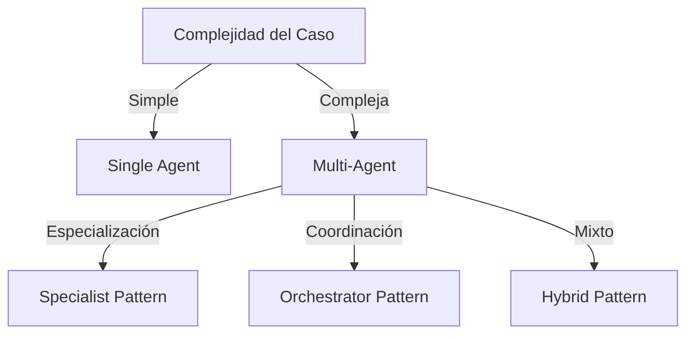

# 📋 Guía de Planeación: Fase 1 del Método BMAD-Bird

> Esta guía consolida el proceso completo de planeación estratégica para implementar AI Employees en Bird.com usando la metodología BMAD.

## 🎯 Objetivo de la Fase

Crear documentación comprehensiva que guíe la implementación exitosa del AI Employee, incluyendo:
- Business Requirements Document (BRD)
- Product Requirements Document (PRD)
- Technical Architecture Document (TAD)

## 📊 Agentes BMAD Activos

1. **Analyst Agent** → Produce BRD
2. **PM Agent** → Produce PRD
3. **Architect Agent** → Produce TAD

---

## 📄 Business Requirements Document (BRD)

### Estructura del BRD

#### 1. Resumen Ejecutivo
- **Objetivo del Proyecto**: Descripción clara del propósito del AI Employee
- **Alcance**: Qué procesos serán automatizados y cuáles no
- **Beneficios Esperados**: ROI proyectado y mejoras operacionales
- **Timeline**: Cronograma de alto nivel

#### 2. Análisis del Estado Actual
- **Procesos Actuales**: Mapeo de workflows existentes
- **Pain Points**: Problemas específicos a resolver
- **Métricas Baseline**: KPIs actuales para comparación futura
- **Recursos Actuales**: Personal, tecnología y presupuesto

#### 3. Evaluación de Plataforma
- **Preparación para Bird.com**: Checklist de requisitos técnicos
- **WhatsApp Business**: Estado de cuenta y verificación
- **Integraciones Necesarias**: APIs y sistemas externos
- **Restricciones Identificadas**: Limitaciones técnicas o de negocio

#### 4. Métricas de Éxito
- **KPIs Operacionales**: Tiempo de respuesta, tasa de resolución
- **KPIs de Negocio**: Conversión, satisfacción, costo por interacción
- **ROI Proyectado**: Análisis financiero detallado
- **Timeline de Beneficios**: Cuándo se esperan resultados

#### 5. Análisis de Riesgos
- **Riesgos Técnicos**: Integraciones, performance, escalabilidad
- **Riesgos de Negocio**: Adopción, cambio organizacional
- **Mitigaciones**: Estrategias para cada riesgo identificado

### Template de Análisis de Negocio

```markdown
## Contexto de Negocio
- **Industria**: [e.g., Real Estate, E-commerce]
- **Tamaño de Empresa**: [Empleados, revenue anual]
- **Mercado Objetivo**: [Demographics, geografía]
- **Volumen de Interacciones**: [Mensajes/día esperados]

## Procesos a Automatizar
1. **[Nombre del Proceso]**
   - Descripción actual
   - Problemas identificados
   - Mejora esperada con AI
   - Métricas de éxito

## Análisis de ROI
- **Costos Actuales**: $X/mes en personal y sistemas
- **Inversión AI Employee**: $Y setup + $Z/mes operación
- **Ahorros Proyectados**: $W/mes
- **Periodo de Recuperación**: N meses
```

---

## 📋 Product Requirements Document (PRD)

### Estructura del PRD

#### 1. Visión del Producto
- **Propósito del AI Employee**: Misión clara y específica
- **Audiencia Objetivo**: Segmentos de usuarios detallados
- **Propuesta de Valor**: Qué hace único a este AI Employee

#### 2. Casos de Uso Detallados

##### Template de Caso de Uso
```markdown
### Caso de Uso: [Nombre]
**Actor**: [Usuario final]
**Trigger**: [Qué inicia la interacción]
**Precondiciones**: [Estado requerido]
**Flujo Principal**:
1. Usuario envía [mensaje inicial]
2. AI Employee responde con [acción]
3. [Continuar hasta completar]
**Flujo Alternativo**: [Variaciones]
**Postcondiciones**: [Estado final]
**Criterios de Éxito**: [Métricas]
```

#### 3. Arquitectura Multi-Agente

**Matriz de Decisión Single vs Multi-Agent**:

| Factor | Single Agent | Multi-Agent |
|--------|--------------|-------------|
| Complejidad de tareas | Baja-Media | Alta |
| Variedad de expertise | Una área | Múltiples áreas |
| Volumen esperado | < 1000/día | > 1000/día |
| Presupuesto | Limitado | Flexible |

#### 4. Especificaciones de Personalidad

```markdown
## Personalidad del AI Employee
**Nombre**: [Nombre del agente]
**Rol**: [e.g., Asesor de Ventas]
**Tono**: [Profesional, Amigable, Casual]
**Idioma Principal**: [e.g., Español Mexicano]
**Características Clave**:
- [Característica 1]
- [Característica 2]
**Frases Típicas**: [Ejemplos de comunicación]
```

#### 5. Requerimientos de Knowledge Base

- **Estructura de Carpetas**: Organización jerárquica
- **Tipos de Contenido**: FAQs, políticas, productos, etc.
- **Volumen Estimado**: Número de documentos
- **Frecuencia de Actualización**: Diaria, semanal, mensual

#### 6. Integraciones WhatsApp

- **Funcionalidades Requeridas**: Rich media, location, buttons
- **Templates de Mensajes**: Notificaciones proactivas
- **Compliance**: Requisitos regulatorios
- **Manejo de Sesiones**: 24-hour window management

---

## 🏗️ Technical Architecture Document (TAD)

### Estructura del TAD

#### 1. Visión Técnica
- **Objetivo Arquitectónico**: Escalabilidad, confiabilidad, performance
- **Principios de Diseño**: Decisiones fundamentales
- **Restricciones Técnicas**: Limitaciones de Bird.com

#### 2. Patrones de Arquitectura

**Selección de Patrón**:



#### 3. Configuración de OpenAI

```markdown
## Estrategia de Modelo
**Decisión de Modelo**:
- GPT-3.5-turbo: Respuestas rápidas, costo-efectivo
- GPT-4: Tareas complejas, mejor comprensión

**Parámetros Óptimos**:
- Temperature: 0.7 (balance creatividad/consistencia)
- Max Tokens: 500 (respuestas concisas)
- Top P: 0.9 (diversidad controlada)
```

#### 4. Arquitectura de Knowledge Base

```
knowledge-base/
├── 01-informacion-general/
│   ├── sobre-nosotros.md
│   └── servicios.md
├── 02-productos/
│   ├── catalogo/
│   └── precios/
├── 03-procesos/
│   ├── ventas/
│   └── soporte/
└── 04-faqs/
    ├── generales.md
    └── tecnicos.md
```

#### 5. Flujos de Integración

- **APIs Externas**: Endpoints, autenticación, rate limits
- **Webhooks**: Eventos entrantes y salientes
- **Error Handling**: Estrategias de recuperación
- **Monitoring**: Métricas y alertas

---

## 🚀 Proceso de Implementación

### Semana 1: Análisis y Documentación

**Día 1-2: Kickoff y Discovery**
- [ ] Reunión inicial con stakeholders
- [ ] Identificación de procesos a automatizar
- [ ] Análisis de sistemas actuales

**Día 3-4: Creación del BRD**
- [ ] Documentar estado actual
- [ ] Definir métricas de éxito
- [ ] Calcular ROI proyectado

**Día 5: Revisión y Aprobación**
- [ ] Presentar BRD a stakeholders
- [ ] Incorporar feedback
- [ ] Obtener aprobación formal

### Semana 2: Diseño de Producto y Arquitectura

**Día 1-2: Desarrollo del PRD**
- [ ] Definir casos de uso detallados
- [ ] Especificar personalidad del AI
- [ ] Diseñar estructura de knowledge base

**Día 3-4: Diseño Técnico**
- [ ] Seleccionar patrón de arquitectura
- [ ] Definir integraciones necesarias
- [ ] Crear diagramas de flujo

**Día 5: Validación Final**
- [ ] Revisar toda la documentación
- [ ] Validar factibilidad técnica
- [ ] Preparar para Fase 2

---

## ✅ Checklist de Salida de Fase 1

### Documentos Completos
- [ ] Business Requirements Document (BRD) aprobado
- [ ] Product Requirements Document (PRD) validado
- [ ] Technical Architecture Document (TAD) revisado
- [ ] Métricas de éxito definidas y acordadas

### Preparación Técnica
- [ ] Cuenta Bird.com con acceso admin confirmado
- [ ] API key de OpenAI obtenida y testeada
- [ ] WhatsApp Business Account verificada
- [ ] Integraciones identificadas y accesos confirmados

### Equipo y Recursos
- [ ] Roles y responsabilidades asignados
- [ ] Timeline detallado para Fase 2
- [ ] Presupuesto aprobado
- [ ] Plan de comunicación establecido

### Contenido Base
- [ ] Audit de contenido existente completado
- [ ] Estructura de knowledge base definida
- [ ] Plan de creación de contenido establecido
- [ ] Responsables de contenido identificados

---

## 📚 Templates y Recursos

### Enlaces a Templates Detallados
- [Template BRD Completo](../examples/real-estate/urbanhub-example.md#brd)
- [Template PRD Completo](../examples/real-estate/urbanhub-example.md#prd)
- [Template TAD Completo](../examples/real-estate/urbanhub-example.md#tad)

### Herramientas de Análisis
- Matriz de evaluación de procesos
- Calculadora de ROI para AI Employees
- Checklist de preparación técnica

---

**Siguiente Paso**: Una vez completada la Fase 1 con todos los documentos aprobados, proceder a la [Fase 2: Configuración](./02-configuration.md) →