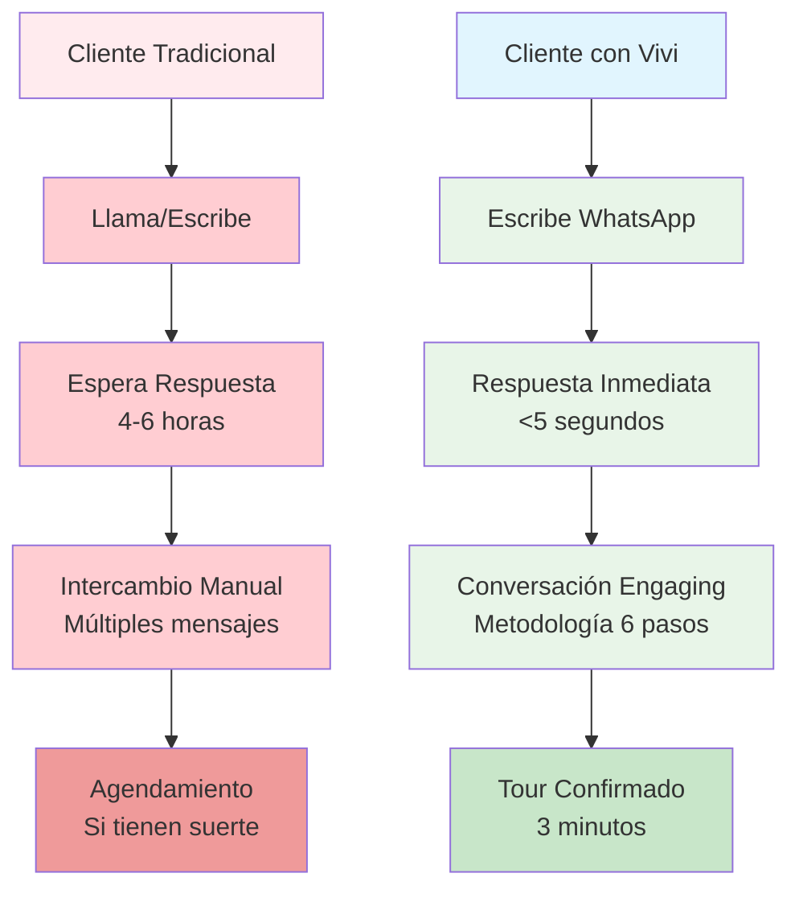
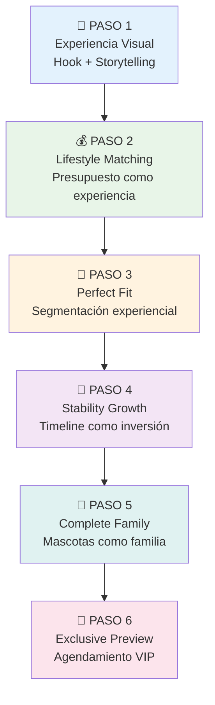
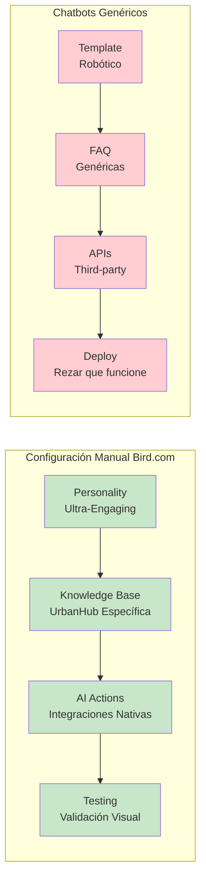
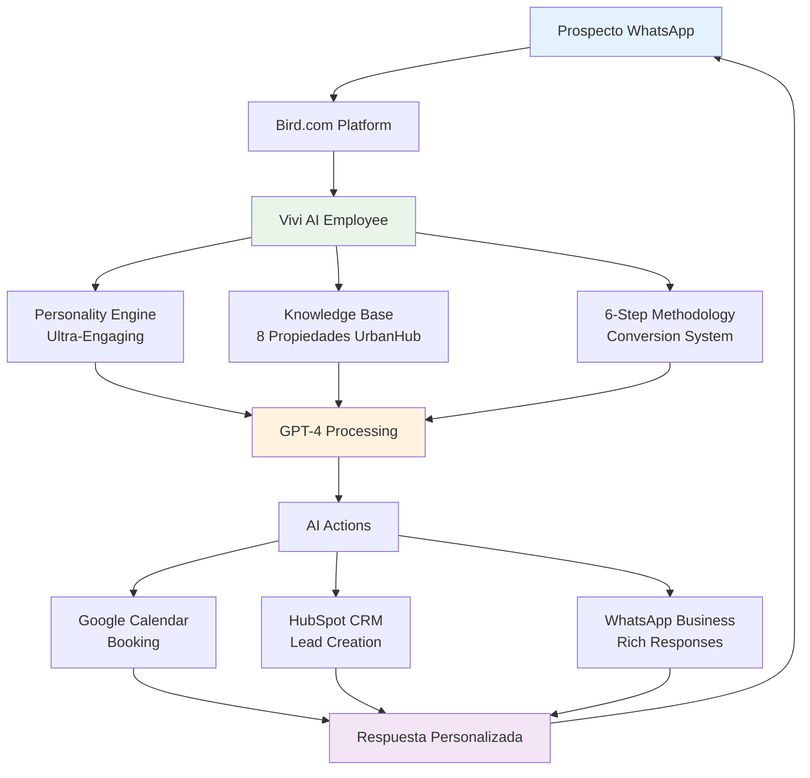
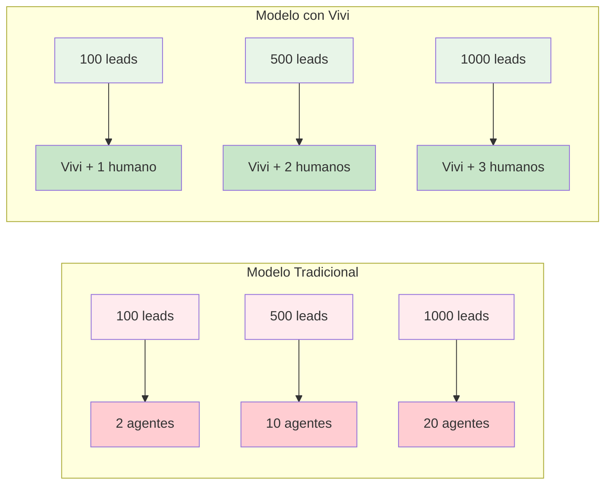
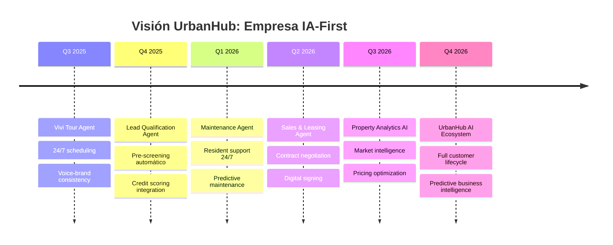
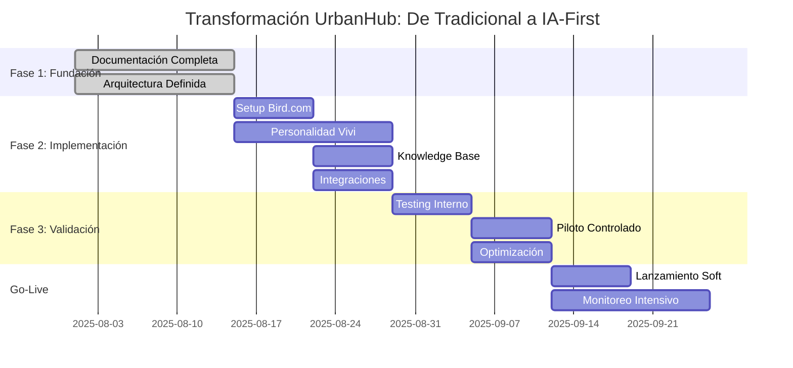
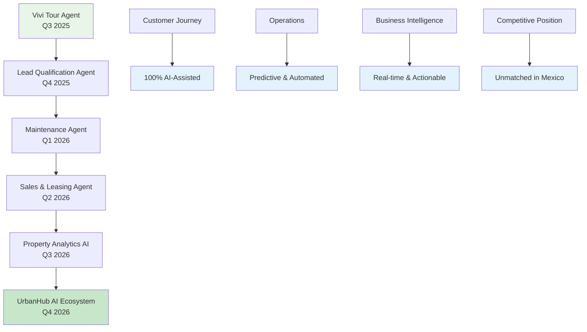

# 🚀 UrbanHub: Transformación Digital con IA Generativa
## Documento Ejecutivo - Revolución con Nuestro Primer AI Employee "Vivi"

**Para**: CEO UrbanHub  
**Fecha**: 4 de Agosto, 2025  
**Preparado por**: Especialista en Transformación Digital IA Real Estate  
**Clasificación**: Transformación Estratégica - Confidencial  

---

## 🎯 Resumen Ejecutivo

### La Gran Transformación
UrbanHub está en el umbral de una **revolución tecnológica** que nos posicionará como **pioneros de la IA generativa** en el sector inmobiliario mexicano. **"Vivi"**, nuestro primer AI Employee, representa mucho más que una herramienta: es el inicio de nuestra evolución hacia una empresa **IA-first** que lidera el futuro del real estate.

### Vivi: Más que un Chatbot, es Nuestro Primer Empleado Digital
**Vivi** no es inteligencia artificial genérica. Es una **especialista ultra-engaging** diseñada específicamente para UrbanHub, que domina nuestro voice-brand, conoce cada propiedad íntimamente, y aplica una **metodología científica de 6 pasos** para convertir prospectos en tours confirmados.

### Revolución Competitiva
- **🌟 Primera en México**: UrbanHub será la primera desarrolladora mexicana con IA generativa auténtica
- **⚡ Disponibilidad Total**: 24/7/365 con respuesta instantánea en español mexicano
- **🎭 Personalidad Única**: Ultra-engaging, no robótica, alineada 100% con nuestro brand
- **🧠 Inteligencia Adaptativa**: Se adapta dinámicamente a cada tipo de prospecto
- **🚀 Escalabilidad Infinita**: Base tecnológica para múltiples agentes especializados

### Decisión Estratégica Requerida
**APROBAR ESTA TRANSFORMACIÓN** significa posicionar a UrbanHub como la **empresa inmobiliaria más innovadora de México**. La ventana de oportunidad es limitada: los próximos 6 meses definirán quién lidera la revolución IA en real estate mexicano.

---

## 🌍 La Revolución de la IA Generativa en Real Estate

### El Cambio Global que Ya Llegó
La **inteligencia artificial generativa** está transformando industrias completas a velocidad exponencial. Empresas como OpenAI, Google y Microsoft han democratizado el acceso a tecnología que antes costaba millones. En real estate, las empresas líderes mundiales ya implementaron IA para:**

- **Estados Unidos**: Zillow, Redfin usan IA para lead qualification 24/7
- **Europa**: Rightmove implementó conversational AI en 12 idiomas  
- **Asia**: PropertyGuru tiene agentes IA que procesan 100K+ consultas/mes
- **Australia**: Domain usa IA para personalizar experiencias de búsqueda

### México: El Último Mercado Sin Explotar
**Oportunidad Histórica**: México es el único mercado G20 donde **ninguna desarrolladora** ha implementado IA generativa auténtica. Estamos hablando de una ventana de oportunidad que se cierra rápidamente.



### Bird.com: La Plataforma Empresarial Elegida por Líderes
**Bird.com** no es otra startup de chatbots. Es la **plataforma empresarial** elegida por Fortune 500 para crear AI Employees auténticos. Sus clientes incluyen empresas que manejan millones de conversaciones mensuales con resultados comprobados.

**¿Por qué Bird.com vs. otras opciones?**
- **Enterprise-grade**: Diseñada para empresas serias, no experimentos
- **Configuración manual**: Control total, no "black box" impredecible  
- **WhatsApp nativo**: Integración directa con Meta, no third-party
- **Escalabilidad comprobada**: Clientes procesan 10M+ mensajes/mes

---

## 🤖 Conoce a Vivi: Nuestro Primer AI Employee

### No es un Chatbot, es una Especialista Digital
**"Vivi - Tour Specialist UrbanHub"** representa una nueva categoría: **AI Employee**. No responde con templates genéricos ni suena robótica. Vivi es una **asesora experta** que domina cada detalle de nuestras 8 propiedades, habla español mexicano auténtico, y aplica una metodología científica para convertir curiosidad en tours confirmados.

### La Personalidad Ultra-Engaging de Vivi
```
Prospecto: "Hola, quiero info de un depa"

Vivi: "¡Hola! ¿Te imaginas llegar a casa y que TODO ya esté resuelto para ti? 🏠

Mira, te voy a platicar algo que cambió la vida de muchas personas...
En Urbanista tu dinero rinde más. Aquí vives sin preocuparte por servicios 
ni mantenimiento—todo está incluido. Mientras nosotros resolvemos, tú avanzas. 
When you live in here, you thrive out there.

¿Qué te llama más: la libertad total o ser el envy de todos? 😍"
```

**¿Notaste la diferencia?** Vivi no solo responde, **engancha emocionalmente** desde el primer mensaje.

### La Metodología Científica de 6 Pasos

Vivi aplica una **metodología probada** que transforma prospectos tibios en tours confirmados:



### Inteligencia Adaptativa: 4 Perfiles de Personalización

Vivi **detecta automáticamente** el tipo de prospecto y adapta su approach:

**🔍 Explorer**: *"Hay tanto que quiero mostrarte... ¿Te imaginas todo lo que puedes hacer aquí?"*

**🎯 Decider**: *"Los números son claros: tu dinero rinde más. Esta es exactamente la inversión inteligente."*

**🌟 Dreamer**: *"Tu vida va a cambiar por completo. Imagínate siendo la persona que siempre quisiste ser."*

**📊 Pragmatic**: *"Cada peso que inviertas regresa en comodidad. Es la decisión más inteligente para tu futuro."*

### Voice-Brand 100% UrbanHub
Vivi nunca improvisa mensajes clave. Usa **textualmente** nuestros mensajes de brand:
- *"Urbanista es mucho más que cuatro paredes"*
- *"En Urbanista tu dinero rinde más"* 
- *"When you live in here, you thrive out there"*
- *"Pet lovers"* (nunca "pet friendly")
- *"Aquí no solo vives—brillas"*

### Capacidades Técnicas Empresariales
- **🕒 Disponibilidad Total**: 24/7/365 sin descansos ni vacaciones
- **🧠 Memoria Perfecta**: Recuerda cada conversación, cada preferencia
- **⚡ Respuesta Instantánea**: <5 segundos, sin importar el volumen
- **🔄 Integraciones Nativas**: Calendar, CRM, WhatsApp Business API
- **📊 Learning Continuo**: Mejora con cada conversación

---

## 🛠️ Tecnología Bird.com: Plataforma Empresarial de IA

### ¿Qué es Bird.com?
**Bird.com** es la **plataforma líder mundial** para crear AI Employees empresariales. No es una startup experimental: es la tecnología elegida por **Fortune 500** para automatizar conversaciones a escala masiva manteniendo calidad humana.

**¿Por qué grandes empresas eligen Bird.com?**
- **🏢 Enterprise-Grade**: Diseñada para empresas serias, no experimentos
- **🔐 Seguridad Total**: Cumple estándares bancarios de protección de datos
- **📈 Escalabilidad Comprobada**: Clientes procesan 10M+ conversaciones/mes
- **🌍 Alcance Global**: Soporta 40+ idiomas con personalización cultural

### La Ventaja de la Configuración Manual
**¿Sabías que la configuración manual es una VENTAJA?** Mientras otras plataformas usan "black boxes" impredecibles, Bird.com nos da **control total**:



### Arquitectura Técnica Simplificada



### Integraciones Empresariales Nativas
**Bird.com** se integra nativamente con las herramientas que ya usamos:
- **📅 Google Calendar**: Verificación de disponibilidad en tiempo real
- **🏢 HubSpot CRM**: Creación automática de leads calificados
- **📱 WhatsApp Business**: Integración directa con Meta (no third-party)
- **📊 Analytics**: Dashboard en tiempo real de conversaciones y conversiones

### Escalabilidad: La Base para el Futuro
Vivi es **solo el inicio**. Bird.com nos permite crear un **ecosistema de AI Employees**:
- **Vivi**: Tour Management (Actual)
- **Futuro Q4 2025**: Lead Qualification Agent
- **Futuro Q1 2026**: Maintenance Support Agent  
- **Futuro Q2 2026**: Sales & Leasing Agent

**Resultado**: UrbanHub evolucionará hacia una **empresa IA-first** donde cada proceso cliente está optimizado por inteligencia artificial.

---

## 🎯 Ventajas Estratégicas para UrbanHub

### 🥇 Diferenciación Competitiva Absoluta
**UrbanHub será la PRIMERA desarrolladora mexicana** con IA generativa auténtica. Esto significa:

**🏆 First-Mover Advantage**
- **6-12 meses** de ventaja antes que competencia reaccione
- **Posicionamiento como innovadores** tecnológicos del sector
- **Atracción de talento top** que quiere trabajar en empresa tech-forward
- **Credibilidad con inversionistas** como empresa de vanguardia

**🌟 Posicionamiento Premium**
- **"La desarrolladora que usa IA"** = diferenciación inmediata
- **Experiencia de cliente superior** genera word-of-mouth positivo
- **Justificación de precios premium** por servicio diferenciado
- **Atracción de millennials/Gen Z** que valoran innovación tecnológica

### 🚀 Escalabilidad Operativa Revolucionaria

**Crecimiento Sin Límites de Personal:**


**🌍 Expansión Geográfica Simplificada**
- **Replicación instantánea** en nuevas ciudades
- **Consistencia de brand** en todas las ubicaciones
- **Aprendizaje centralizado** beneficia todas las propiedades
- **Optimización continua** basada en data agregada

### 📊 Inteligencia de Negocio Automatizada

**Data de Oro que Nunca Tuvimos:**
- **Patrones de conversación** más efectivos por tipo de prospecto
- **Objeciones más comunes** por propiedad/ubicación/precio
- **Horarios óptimos** para diferentes perfiles demográficos
- **Mensajes que convierten** vs. mensajes que alejan
- **Insights de mercado** basados en thousands de conversaciones

### 🎯 Preparación para el Futuro

**Fundación Tecnológica para 2025-2027:**
Vivi es **solo el primer escalón** de nuestra transformación digital:



### 💎 Valor de Marca Transformacional

**De Desarrolladora Tradicional a Tech Company:**
- **Atracción de inversión** como empresa tecnológica
- **Retención de talento** por ambiente innovador
- **Partnerships estratégicos** con empresas tech
- **Reconocimiento de industria** como thought leaders
- **Valuación premium** por capacidades tecnológicas

---

## 🚀 Roadmap de Implementación y Visión Futura

### Metodología BMAD: 6 Semanas hacia la Transformación

**BMAD** (Breakthrough Method for Agile AI-Driven Development) es la metodología probada que hemos usado para planear esta transformación. **No es experimento**: es proceso ingenierizado con resultados predecibles.



### Recursos Mínimos Requeridos

**Equipo Interno (Part-time):**
- **Product Owner**: 20% de tiempo por 6 semanas
- **Coordinador Ventas**: 30% de tiempo por 4 semanas  
- **Marketing Specialist**: 15% de tiempo por 2 semanas

**Inversión Total**: Configuración, contenido, integraciones y capacitación incluidos

**Riesgo Técnico**: **MÍNIMO** - Metodología BMAD probada, plataforma enterprise

### Visión 2026: UrbanHub como Empresa IA-First



### El Momento Decisivo

**¿Por qué AHORA es el momento perfecto?**

1. **🎯 Ventana de Oportunidad**: Somos PRIMEROS en México
2. **🛠️ Tecnología Madura**: Bird.com + GPT-4 son enterprise-ready
3. **📈 Mercado Receptivo**: Millennials/Gen Z esperan experiencias IA
4. **💰 ROI Inmediato**: Beneficios visibles desde semana 1
5. **🚀 Fundación Escalable**: Una inversión, múltiples agentes futuros

**¿Qué pasa si esperamos 6 meses más?**
- ❌ **Competencia despierta** y pierde first-mover advantage
- ❌ **Tecnología se commoditiza** y pierde diferenciación
- ❌ **Costos aumentan** por mayor competencia de talent tech
- ❌ **Oportunidad se diluye** entre múltiples players

## 🎯 Decisión del CEO Requerida

### **APROBAR ESTA TRANSFORMACIÓN DIGITAL**

**Significa:**
✅ **Posicionar UrbanHub** como líder tecnológico del real estate mexicano  
✅ **Iniciar evolución** hacia empresa IA-first del sector  
✅ **Asegurar ventaja competitiva** sostenible por 2-3 años  
✅ **Atraer talento e inversión** por perfil innovador  
✅ **Preparar fundación** para escalamiento exponencial  

**Esta no es decisión de "implementar una herramienta". Es decisión de TRANSFORMAR UrbanHub en la empresa inmobiliaria más avanzada tecnológicamente de México.**

**La pregunta real es:** 
*¿Queremos ser los que lideran el futuro o los que reaccionan a él?*

---

## 🌟 El Futuro Comienza Hoy

**Vivi** no es solo nuestro primer AI Employee. Es el **primer paso hacia un futuro** donde UrbanHub domina el mercado inmobiliario mexicano atraves de inteligencia artificial, experiencias extraordinarias, y ventaja competitiva tecnológica.

**El futuro del real estate mexicano se decide en los próximos 90 días.**

**UrbanHub puede liderarlo o reaccionar a él.**

**La decisión es nuestra.**

---

**🚀 UrbanHub: Liderando la Revolución IA en Real Estate Mexicano**

*Documento de Transformación Digital | Metodología BMAD | Confidencial UrbanHub*