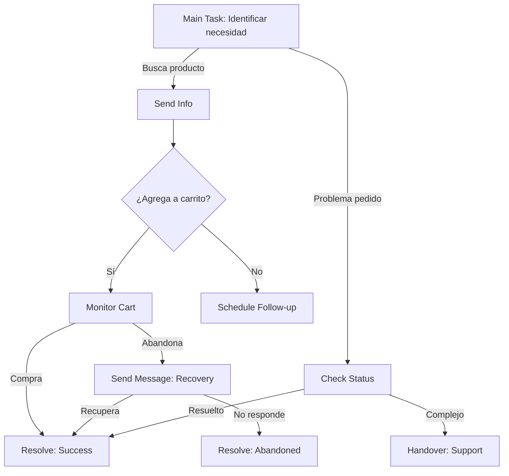

# 🎯 Template de AI Actions para Bird.com

> Configuraciones detalladas y mejores prácticas para automatizar acciones en AI Employees.

## 🔧 Tipos de AI Actions en Bird.com

### 1. Main Task Action
- **Propósito**: Define la tarea principal del AI Employee
- **Trigger**: Inicio de cada conversación
- **Uso**: Establecer contexto y objetivo inicial

### 2. Handover Action
- **Propósito**: Transferir conversación a otro agente
- **Trigger**: Keywords, intención o condiciones específicas
- **Uso**: Escalación a humanos o entre AI Employees

### 3. Send Message Action
- **Propósito**: Enviar mensajes proactivos automatizados
- **Trigger**: Tiempo, eventos o condiciones
- **Uso**: Follow-ups, recordatorios, notificaciones

### 4. Resolve Conversation Action
- **Propósito**: Cerrar conversaciones automáticamente
- **Trigger**: Objetivos cumplidos o inactividad
- **Uso**: Mantener inbox organizado

---

## 📋 Main Task Action

### Configuración Básica

```yaml
action_type: main_task
trigger: conversation_start
priority: high
```

### Templates por Industria

#### E-commerce
```markdown
## Instrucciones para Main Task

Cuando un usuario inicia conversación:

1. **Identificar intención principal**:
   - Compra de producto → Mostrar categorías populares
   - Estado de pedido → Solicitar número de orden
   - Soporte → Identificar tipo de problema
   - General → Ofrecer menú de opciones

2. **Calificar al usuario**:
   - ¿Cliente nuevo o recurrente?
   - ¿Tiene pedidos activos?
   - ¿Historial de compras relevante?

3. **Personalizar respuesta**:
   - Usar nombre si está disponible
   - Referenciar compras anteriores si aplica
   - Ajustar ofertas según perfil

4. **Guiar hacia conversión**:
   - Siempre ofrecer productos relevantes
   - Facilitar proceso de compra
   - Minimizar fricciones

Variables disponibles:
- {{contact.name}}
- {{contact.purchase_history}}
- {{contact.last_order_status}}
```

#### Real Estate
```markdown
## Instrucciones para Main Task

Cuando un usuario inicia conversación:

1. **Determinar etapa del journey**:
   - Exploración inicial → Educar sobre opciones
   - Búsqueda activa → Calificar necesidades
   - Listo para visitar → Agendar tour
   - Post-visita → Follow up y cierre

2. **Información clave a obtener**:
   - Presupuesto (rango)
   - Ubicación preferida
   - Tipo de propiedad
   - Timeline de decisión
   - Financiamiento (propio/crédito)

3. **Acciones según perfil**:
   - Budget < X → Mostrar opciones accesibles
   - Budget > Y → Ofrecer servicio premium
   - Urgente → Priorizar disponibilidad inmediata
   - Explorando → Educar y nutrir

4. **Objetivos de conversación**:
   - Mínimo: Capturar datos de contacto
   - Ideal: Agendar visita
   - Óptimo: Calificar completamente

Variables disponibles:
- {{contact.budget_range}}
- {{contact.preferred_location}}
- {{available_properties_count}}
```

#### Servicios Profesionales
```markdown
## Instrucciones para Main Task

Cuando un usuario inicia conversación:

1. **Identificar necesidad de servicio**:
   - Consulta inicial → Explicar servicios
   - Cotización → Capturar requerimientos
   - Soporte existente → Verificar cuenta
   - Emergencia → Escalar inmediatamente

2. **Calificación de lead B2B**:
   - Tamaño de empresa
   - Industria
   - Presupuesto estimado
   - Decisor o influencer
   - Timeline del proyecto

3. **Ruta de conversación**:
   - PYME → Paquetes estandarizados
   - Enterprise → Soluciones custom
   - Startup → Opciones flexibles
   - Gobierno → Requisitos especiales

4. **Next steps claros**:
   - Agendar llamada discovery
   - Enviar propuesta básica
   - Compartir casos de éxito
   - Conectar con especialista

Variables disponibles:
- {{contact.company_name}}
- {{contact.industry}}
- {{service_catalog}}
```

### Mejores Prácticas Main Task

1. **Claridad en objetivos**: Define exactamente qué debe lograr
2. **Flexibilidad**: Contempla múltiples caminos de usuario
3. **Contexto**: Usa toda la información disponible
4. **Medible**: Define qué constituye éxito

---

## 🤝 Handover Action

### Configuración Básica

```yaml
action_type: handover
priority: high
preserve_context: true
```

### Triggers Recomendados

#### Por Keywords
```markdown
## Keywords para Handover

**Alta Prioridad (Inmediato)**:
- "hablar con humano"
- "agente real"
- "supervisor"
- "gerente"
- "queja formal"
- "urgente"
- "emergencia"

**Media Prioridad (Rápido)**:
- "no me sirve"
- "no entiendes"
- "problema serio"
- "necesito ayuda real"
- "esto no funciona"

**Baja Prioridad (Normal)**:
- "prefiero persona"
- "mejor con alguien"
- "puedo hablar con"
```

#### Por Intención Detectada
```markdown
## Intenciones para Handover

1. **Frustración Alta**:
   - Múltiples negaciones
   - Palabras de enojo
   - Repetición de pregunta 3+ veces
   - Uso de mayúsculas excesivo

2. **Complejidad Técnica**:
   - Preguntas legales
   - Casos edge específicos
   - Integraciones custom
   - Problemas de facturación

3. **Valor Alto**:
   - Compras > $X
   - Cliente VIP identificado
   - Oportunidad enterprise
   - Renovación importante

4. **Situaciones Sensibles**:
   - Menciones de competencia
   - Solicitudes de cancelación
   - Feedback muy negativo
   - Temas regulatorios
```

#### Por Condiciones
```markdown
## Condiciones para Handover

**Basadas en Comportamiento**:
IF conversation_duration > 15 minutos
AND resolution_achieved = false
THEN handover_to_human

IF failed_attempts > 3
AND same_topic = true
THEN handover_to_specialist

**Basadas en Perfil**:
IF customer_tier = "VIP"
AND query_type = "complaint"
THEN handover_priority = "HIGH"

IF account_value > $10000
OR churn_risk = "high"
THEN handover_to_senior_agent

**Basadas en Contexto**:
IF business_hours = false
AND query_urgency = "high"
THEN handover_to_oncall

IF language != supported_languages
THEN handover_to_multilingual_team
```

### Templates de Mensajes de Handover

#### Handover Estándar
```markdown
Entiendo que prefieres hablar con un miembro de nuestro equipo.

Te voy a transferir con [Equipo/Nombre] quien podrá asistirte mejor con [tema específico].

⏱️ Tiempo de espera estimado: [X minutos]

Mientras te conecto, he preparado un resumen de nuestra conversación para que no tengas que repetir nada.
```

#### Handover VIP
```markdown
[Nombre], como cliente premium, te mereces atención especializada.

Te conecto inmediatamente con nuestro equipo VIP para asistirte personalmente.

Tu ejecutivo dedicado revisará todo el contexto de tu consulta.

¡Gracias por tu preferencia!
```

#### Handover Técnico
```markdown
Tu consulta requiere expertise técnico especializado.

Te voy a conectar con nuestro equipo de ingeniería que podrá:
✓ Revisar tu caso en detalle
✓ Proporcionar solución específica
✓ Dar seguimiento hasta resolver

Transferiendo ahora...
```

### Configuración de Destinos

```yaml
handover_destinations:
  - name: "Equipo General"
    queue: "support_general"
    hours: "9:00-18:00"
    sla: "5 minutos"
    
  - name: "Soporte Técnico"
    queue: "support_technical"
    hours: "24/7"
    sla: "10 minutos"
    skills_required: ["technical", "product"]
    
  - name: "Ventas Senior"
    queue: "sales_senior"
    hours: "9:00-20:00"
    sla: "2 minutos"
    min_deal_size: 5000
    
  - name: "Team VIP"
    queue: "vip_support"
    hours: "8:00-22:00"
    sla: "30 segundos"
    customer_tiers: ["platinum", "gold"]
```

---

## 📨 Send Message Action

### Configuración Básica

```yaml
action_type: send_message
channel: whatsapp
template_required: true  # for messages outside 24hr window
```

### Casos de Uso Comunes

#### 1. Recordatorio de Cita
```markdown
## Configuración

**Trigger**: 
- Tipo: Tiempo
- Cuando: 24 horas antes de cita agendada
- Condición: appointment_status = "confirmed"

**Mensaje**:
¡Hola {{contact.name}}! 

Te recordamos tu cita mañana:
📅 {{appointment.date}}
🕐 {{appointment.time}}
📍 {{appointment.location}}

Responde:
✅ CONFIRMAR si asistirás
❌ CANCELAR si no podrás
📝 CAMBIAR para reagendar

**Acciones Post-Envío**:
- Si responde CONFIRMAR → Marcar como confirmed_twice
- Si responde CANCELAR → Ejecutar flujo cancelación
- Si responde CAMBIAR → Iniciar flujo reagendamiento
- Si no responde → Enviar segundo recordatorio en 12 hrs
```

#### 2. Abandono de Carrito
```markdown
## Configuración

**Trigger**:
- Tipo: Evento
- Cuando: 2 horas después de agregar a carrito
- Condición: cart_abandoned = true AND purchase_completed = false

**Mensaje Secuencia 1** (2 horas):
Hola {{contact.name}}, notamos que dejaste algunos items geniales en tu carrito 🛒

{{cart.items_list}}

¿Necesitas ayuda para completar tu compra? Estoy aquí para asistirte.

💡 Tip: Estos items tienen envío gratis hoy.

**Mensaje Secuencia 2** (24 horas):
¡Último día para aprovechar envío gratis! 

Tus items guardados:
{{cart.summary}}

Usa código REGRESA10 para 10% extra de descuento.

[Completar Compra] → {{cart.checkout_url}}

**Mensaje Secuencia 3** (72 horas):
{{contact.name}}, tus items están por agotarse 😱

Stock actual:
{{cart.items_stock_status}}

Esta es tu última oportunidad. ¿Quieres que reserve estos items por 24 horas más?

**Condiciones de Parada**:
- Si completa compra → Detener secuencia
- Si responde "NO" → Marcar opt-out abandono
- Si items agotados → No enviar mensaje
```

#### 3. Nurturing de Leads
```markdown
## Configuración

**Trigger**:
- Tipo: Tiempo + Condición
- Cuando: 7 días después de último contacto
- Condición: lead_status = "warm" AND no_recent_interaction

**Secuencia de Nurturing**:

**Semana 1**: Contenido de Valor
Hola {{contact.name}}, 

Pensé que te interesaría este artículo sobre {{interest_topic}}:

"{{content.title}}"
{{content.summary}}

Lee más aquí: {{content.url}}

**Semana 3**: Case Study
¡Mira este caso de éxito!

{{case_study.client}} logró {{case_study.result}} usando nuestro {{service}}.

¿Te gustaría saber cómo podrías lograr resultados similares?

**Semana 5**: Oferta Especial
{{contact.name}}, tenemos una promoción exclusiva para ti:

🎯 {{offer.description}}
💰 {{offer.discount}}
⏰ Válido hasta {{offer.expiry}}

¿Conversamos sobre cómo aprovecharla?

**Semana 8**: Última Touchpoint
Hola {{contact.name}},

No quiero molestarte, solo verificar si sigues interesado en {{service}}.

Si es así, me encantaría retomar la conversación.
Si no, no hay problema. ¿Prefieres que pause las comunicaciones?

**Reglas de Engagement**:
- Pausar si abre pero no responde 3 veces
- Aumentar valor en cada touchpoint
- Personalizar basado en interacciones previas
```

#### 4. Post-Venta Follow Up
```markdown
## Configuración

**Trigger**:
- Tipo: Evento
- Cuando: 3 días post-entrega
- Condición: order_delivered = true

**Mensaje**:
¡Hola {{contact.name}}! 🎉

Espero que estés disfrutando tu {{product.name}}.

¿Cómo ha sido tu experiencia hasta ahora?

⭐⭐⭐⭐⭐ Excelente
⭐⭐⭐⭐ Buena
⭐⭐⭐ Regular
⭐⭐ Mala
⭐ Muy mala

Tu opinión nos ayuda a mejorar.

**Flujos según respuesta**:
- 4-5 estrellas → Solicitar review público
- 3 estrellas → Preguntar cómo mejorar
- 1-2 estrellas → Escalar a servicio al cliente
```

### Mejores Prácticas Send Message

1. **Timing estratégico**: Enviar en horarios óptimos de apertura
2. **Frecuencia controlada**: Max 2-3 mensajes por semana
3. **Valor en cada mensaje**: No enviar por enviar
4. **Personalización**: Usar todos los datos disponibles
5. **Opt-out fácil**: Siempre ofrecer manera de parar

---

## ✅ Resolve Conversation Action

### Configuración Básica

```yaml
action_type: resolve_conversation
auto_resolve: true
send_summary: true
```

### Condiciones de Resolución

#### Por Objetivo Cumplido
```markdown
## Resolución por Éxito

**E-commerce**:
- Compra completada
- Tracking proporcionado
- Devolución procesada
- Pregunta respondida + confirmación

**Real Estate**:
- Tour agendado
- Información enviada
- Aplicación completada
- Documentos recibidos

**Servicios**:
- Ticket creado
- Cita confirmada
- Cotización enviada
- Problema resuelto

**Mensaje de Cierre**:
¡Perfecto! He completado tu solicitud de {{action_completed}}.

Resumen:
✅ {{summary_point_1}}
✅ {{summary_point_2}}
✅ {{summary_point_3}}

¿Hay algo más en lo que pueda ayudarte?

[Si no hay respuesta en 5 minutos, cerrar automáticamente]
```

#### Por Inactividad
```markdown
## Resolución por Timeout

**Configuración de Tiempos**:
- Primera espera: 5 minutos
- Reminder: "¿Sigues ahí? 👋"
- Segunda espera: 10 minutos
- Warning: "Voy a cerrar esta conversación en 5 minutos si no hay respuesta"
- Tercera espera: 5 minutos
- Cierre automático

**Mensaje de Cierre por Inactividad**:
Parece que no estás disponible en este momento.

He guardado nuestra conversación y estaré aquí cuando quieras continuar.

¡Hasta pronto! 👋

**Preservar contexto para**:
- Procesos incompletos
- Carritos con items
- Citas por confirmar
- Cotizaciones pendientes
```

#### Por Confirmación Explícita
```markdown
## Resolución por Confirmación

**Triggers de Confirmación**:
- "gracias"
- "listo"
- "perfecto"
- "eso es todo"
- "ya está"
- "bye"
- "adiós"

**Flujo de Confirmación**:
Usuario: "Gracias, eso es todo"
AI: "¡De nada! ¿Hay algo más en que pueda ayudarte?"
Usuario: "No"
AI: [Mensaje de cierre + resolver]

**Mensaje de Cierre Confirmado**:
¡Ha sido un placer ayudarte! 😊

Si necesitas algo más, no dudes en escribirme. Estoy disponible 24/7.

¡Que tengas un excelente [día/tarde/noche]!

[Conversación resuelta]
```

### Reportes Post-Resolución

```markdown
## Datos a Capturar

**Métricas de Conversación**:
- Duración total
- Mensajes intercambiados
- Intenciones detectadas
- Acciones completadas
- Satisfacción (si se midió)

**Tags de Categorización**:
- Tipo de consulta
- Resultado
- Productos/servicios involucrados
- Valor de oportunidad
- Próximos pasos

**Seguimiento Requerido**:
- [ ] Follow-up programado
- [ ] Escalación pendiente
- [ ] Tarea para equipo humano
- [ ] Oportunidad de venta
```

---

## 🔄 Orquestación de Actions

### Ejemplo: Flujo Completo E-commerce



### Priorización de Actions

```yaml
action_priority:
  1: handover_urgent      # Siempre máxima prioridad
  2: main_task           # Define contexto base
  3: handover_normal     # Escalaciones estándar
  4: send_time_sensitive # Mensajes urgentes
  5: send_scheduled      # Mensajes programados
  6: resolve_auto        # Limpieza automática
```

---

## 📊 Métricas y Optimización

### KPIs por Action Type

#### Main Task
- Task completion rate
- Time to identify intent
- Routing accuracy

#### Handover
- Escalation rate (target: <20%)
- Handover success rate
- Context preservation score

#### Send Message
- Open rate por tipo mensaje
- Response rate
- Conversion rate

#### Resolve
- Auto-resolution rate (target: >80%)
- False positive resolutions
- Re-open rate

### A/B Testing Ideas

1. **Timing de mensajes**: Mañana vs tarde
2. **Frecuencia de follow-ups**: 2 vs 3 vs 4 touches
3. **Triggers de handover**: Más vs menos sensible
4. **Mensajes de cierre**: Cortos vs detallados

---

## 💡 Tips de Implementación

### Do's ✅
1. **Testear exhaustivamente** cada action antes de activar
2. **Monitorear métricas** diariamente al inicio
3. **Iterar basado en datos** reales, no suposiciones
4. **Documentar configuraciones** para futuras referencias
5. **Coordinar con equipo humano** sobre handovers

### Don'ts ❌
1. **No sobre-automatizar** - mantener toque humano
2. **No bombardear** con mensajes automatizados
3. **No resolver prematuramente** conversaciones activas
4. **No ignorar feedback** sobre actions molestas
5. **No olvidar contexto** en handovers

---

**Recuerde**: Las AI Actions bien configuradas son la diferencia entre un chatbot básico y un verdadero AI Employee que genera valor.